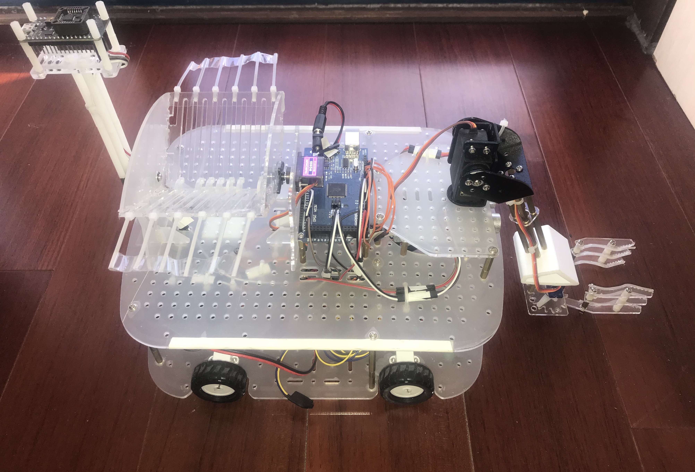
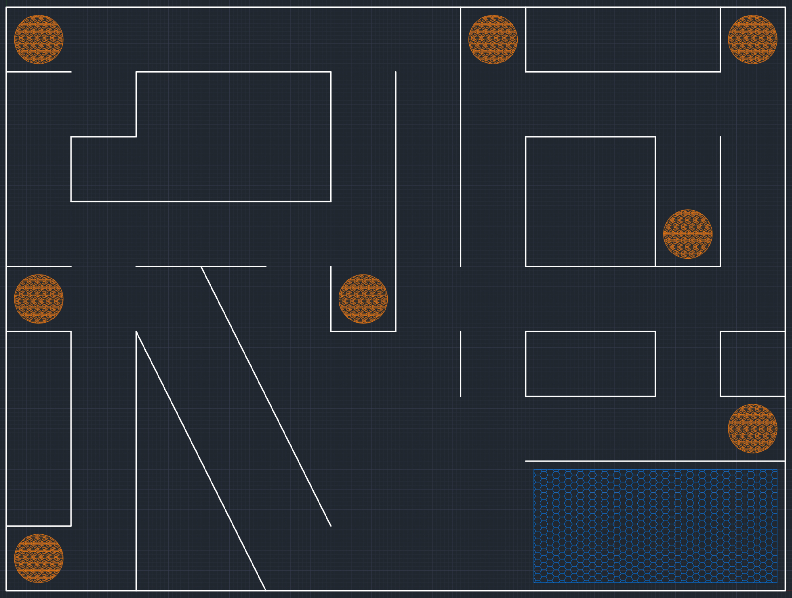

# Bio

<table border="0">
    <td width="60%">
I'm a senior student at the Automation Science Department, Beihang University, Beijing China. My research interests are computer vision, robotics and machine learning systems. Currently, I'm working as a summer intern with Prof. [Yonggang Wen](https://www.ntu.edu.sg/home/ygwen/). Before that, I worked with Prof. [Baochang Zhang](https://scholar.google.co.jp/citations?user=WH0J_34AAAAJ&hl=en&oi=ao) at Beihang University and Prof. [Gao Huang](http://www.gaohuang.net/) at Tsinghua University.

I plan to apply for master's and Ph.D. programs in both EE and CS directions.
    </td>
    <td width="40%">
    </td>
</table>

# Projects

### Chief Topic Maker of 7th "_Yuyuan_" Robot Contest  (2019.10)

I am honored to be the chief topic maker of the “Yuyuan” Robot Contest of Automation Science Department. The topic I made will require teams to use multi-modal sensors and to achieve precise controls over their vehicles' motion.

### A Self-naviagted Vehicle with A Tracking Camera and Dynamic Route Planning  Algorithms (2018.12)

-   Dynamic Route Planning: The vehicle was required to find 5 out of 8 valid locations (candidates marked in orange) in a maze, and carry the payload to assigned locations. Our strategy was 1) pre-store rough map 2) update valid locations during exploration 3) compute the shortest transporting routes. The algorithms were deployed on an ATMEGA328P chip.

    ​					     

-   Tracking Camera: We chose OpenMV, an integrated camera module programmable in Python. We built a motor-driven camera platform. It allowed the camera to track targets in a wider range. 

    ​										     

-   Multi-sensors: We used a gyroscope is to detect its orientation roughly. We used four ultrasonic sensors for distance detection and preciser orientation adjustments. We used infrared sensors to locate.

-   Customized Mechanical Arm and Decks: We 3D printed essential components. We modeled the assemblies in SolidWorks and laser-cut the decks.

    ​					    

    ​									     
    
    
    
    

# Researches

### Regularizing Deep Networks with Semantic Data Augmentation (2020.05)

*Yulin Wang, Xuran Pan, Shiji Song, **Yitong Xia**, Hong Zhang, Cheng Wu, Gao Huang*. *IEEE Transactions on Pattern Analysis and Machine Intelligence (TPAMI). (In revision)*

An effective and efficient data augmentation method. It first online estimates the covariance matrix of each class's deep feature, and sample zero-mean normal distributions from those matrices to find meaningful semantic directions of deep features. Then it randomly augments the original features along zero-mean normal distributions. To handle the computation cost, we take the upper bound of the original loss as optimizing loss. This method fits in both supervised and semi-supervised learning and can improve performances of classical classification architectures, such as *ResNet* or *mean teacher*. My contributions are: I improved the method to fit it in semi-supervised learning settings and independently implemented the experiments.

### Graph Embedding Relation Networks for Few-shot Learning (2019.12)

_Zhen Liu*, **Yitong Xia\***, BaoChang Zhang, Kexin Liu. Chinese Control Conference (CCC2020)._

A few-shot classification architecture. To further enhance the relation learning within classes, we design a 3-layer graph relation module. To balance the lower and higher level features, we skip connect the graph module. The graph module can easily fit in any one-stage learning architectures. Our approach is brief, yet it can achieve higher few-shot classification accuracies on _miniImageNet_ and _tieredImageNet_ than existing graph approaches.

# Experience

### UIUC Summer School (2018.07)

I attended the summer school program at University of Illinois at Urbana-Champaign. I attended 2 courses: Control Systems and Artificial Intelligence.

