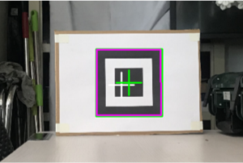
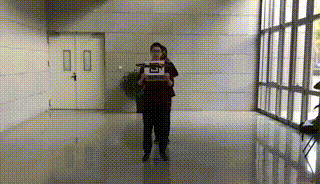
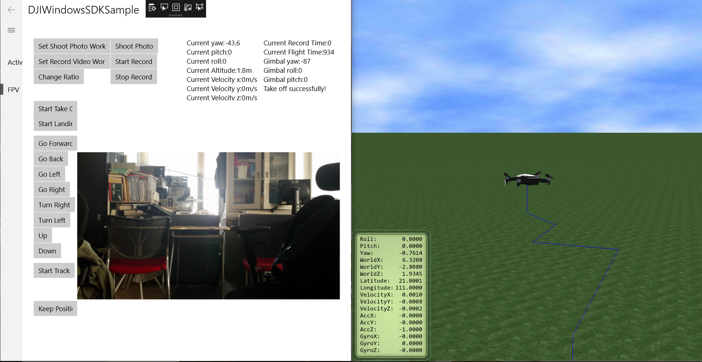

# Bio

I'm a senior student at the Automation Science Department, Beihang University, Beijing, China. I held an average GPA of 3.80/4.00 or 91/100 for the past three years.

  

My research interests are computer vision, machine learning and ML systems. Currently, I'm working as a summer intern with <a href="https://www.ntu.edu.sg/home/ygwen/">Prof. Yonggan Wen</a>. Before that, I worked with <a href="https://scholar.google.co.jp/citations?user=WH0J_34AAAAJ&hl=en&oi=ao">Prof. Baochang Zhang</a> at Beihang University and <a href="http://www.gaohuang.net/">Prof. Gao Huang</a> at Tsinghua University.

       
I plan to apply for master's and Ph.D. programs in both EE and CS directions.

# Researches
### Baconian: A Model-Based Reinforcement Learning Framework (2020.08)
*Still in process*

In this work we developed a framework for model-based reinforcment learning named *Baconian*[beˈkonin]. It provides several classical model-free and model-based benchmarks for reproducing. Its flexible and modularized architecture enable users to set up their model-based RL experiments efficiently. 

### Regularizing Deep Networks with Semantic Data Augmentation (2020.05) [<a href="https://arxiv.org/abs/2007.10538">arxiv</a>]
*Yulin Wang, Xuran Pan, Shiji Song, **Yitong Xia**, Hong Zhang, Cheng Wu, Gao Huang*. *IEEE Transactions on Pattern Analysis and Machine Intelligence (TPAMI). (Under revision)*

In this work we expanded an effective feature-space augmentation method. Firstly it online estimates the covariance matrix of each class's deep feature, and sample zero-mean normal distributions from those matrices to find meaningful semantic directions for deep features. Secondly it augments the deep features along zero-mean normal distributions. To handle the computation cost, we took the upper bound of the original loss as optimizing loss. This method fits in both supervised and semi-supervised learning and can improve performances of classical classification baselines, such as *ResNet50* or *mean teacher*. My contributions are: (1) Improved the data augmentation to fit it in semi-supervised learning settings and implemented series of experiments. (2) Visualized the augmented feature by projecting feature space to image space with Generative Adversarial Network.

### Graph Embedding Relation Networks for Few-shot Learning (2019.12)
*Zhen Liu*, **Yitong Xia\***, BaoChang Zhang, Kexin Liu. Chinese Control Conference (CCC2020).*

In this work we designed a few-shot classification architecture. To further enhance the relation learning within classes, we design a 3-layer graph relation module. To balance the lower and higher level features, we skip connect the graph module. The graph module can easily fit in any one-stage learning architectures. Our approach is brief, yet it can achieve higher few-shot classification accuracies on _miniImageNet_ and _tieredImageNet_ than existing graph approaches. I was the co-first author in this work.

# Projects
### Non-contact Heart Rate Measurement with Depth Camera(2020.11)
- We use a Microsoft Kinect to obtain depth image and measure the heart rate. This will be my graduation project and it is in process.

### Visual Marker Tracking and Flight Control Algorithms for DJI Mavic Air Development(2020.10)
- Visual Recognition Algorithm: Based on OpenCVSharp, I designed a detection algorithm to detect a square marker. The algorithm could: (1) provide stable marker detection in a disturbing context. It was robust to changing backgronds and lightening. (2) provide fast dectection. The detection speed could reach 30 fps. (3) provide stable three-axis distance esimations, which input to the flight control algorithm.

​                                     

- Flight Control Algorithm: We simulated the control algorithm in both Simulink and DJI Assistant environments before deploying it to the drone.

​                                                        
- Desktop-class Console: Based on DJIWindowsSDK, we developed a monitor console that displayed instant accelerations, velocities, spacial coordinates, and instant camera image.

### Pattern Recognition Course: Classification on Medical Cell Dataset
- The dataset contains three classes of cells: Lymphocyte, Normal Epithelial, and Malignant Epithelial.
- We properly preprocessed the contexted cell image and trained a classification network through transfer learning. The final classification accuracies reached 95% classification accuracy and ranked 1/22 among all groups.

### Chief Topic Maker of 7th "_Yuyuan_" Robot Contest  (2019.10)

- I am honored to be the chief topic maker of the “Yuyuan” Robot Contest of Automation Science Department. The topic I made will require teams to use multi-modal sensors and to achieve precise controls over their vehicles' motion.

### A Self-naviagted Vehicle with A Tracking Camera and Dynamic Route Planning Algorithms (2018.12)

- Dynamic Route Planning: The vehicle was required to find 5 out of 8 valid locations (candidates marked in orange) in a maze, and carry the payload to assigned locations. Our strategy was to (1) pre-store a rough map (2) update valid locations during exploration (3) rank distances of different routes and pick the optimal one. The algorithms were deployed on an ATmega328P chip.

    ​					               

- Tracking Camera: We chose OpenMV, an integrated camera module programmable in Python. I built a motor-driven camera platform. It allowed the camera to track targets in a wider range. 

    ​                                         

- Multi-sensors: We used a gyroscope is to detect its orientation roughly. We used four ultrasonic sensors for distance detection and preciser orientation adjustments. We used infrared sensors to locate.

- Customized Mechanical Arm and Decks: We 3D printed essential components. We simluated the assemblies in SolidWorks and had them laser-cut.

# Experience
### UIUC Summer School (2018.08)

- I attended the summer school program at University of Illinois at Urbana-Champaign. I attended 2 courses: Control Systems and Artificial Intelligence.

